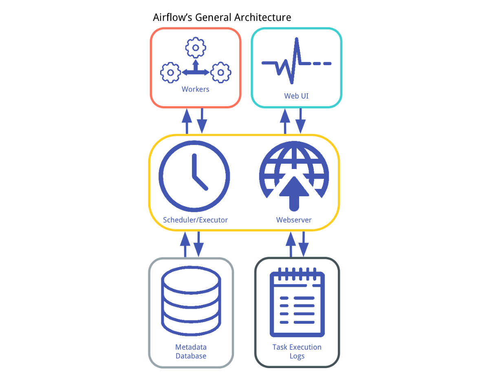

# Airflow Codebase Template

## Background

Apache Airflow is the leading orchestration tool for batch workloads. Originally conceived at Facebook and eventually open-sourced at AirBnB, Airflow allows you to define complex directed acyclic graphs (DAG) by writing simple Python. 

Airflow has a number of built-in concepts that make data engineering simple, including DAGs (which describe how to run a workflow) and Operators (which describe what actually gets done). See the Airflow documentation for more detail: https://airflow.apache.org/concepts.html 

Airflow also comes with its own architecture: a database to persist the state of DAGs and connections, a web server that supports the user-interface, and workers that are managed together by the scheduler and database. Logs persist both in flat files and the database, and Airflow can be setup to write remote logs (to S3 for example). Logs are viewable in the UI.

## A Note on managing Airflow dependencies

Airflow is tricky to install correctly because it is both an application and a library. Applications freeze their dependencies to ensure stability, while libraries leave their dependencies open for upgrades to take advantage of new features. Airflow is both, so it doesn't freeze dependencies. This means that depending on the day, a simple `pip install apache-airflow` is not guaranteed to produce a workable version of the Airflow application. 

To combat this, Airflow provides a set of [constraints files](https://airflow.apache.org/docs/apache-airflow/stable/installation.html#constraints-files) that are known working versions of Airflow. 

This template installs Airflow using the constraints file at `https://raw.githubusercontent.com/apache/airflow/constraints-${AIRFLOW_VERSION}/constraints-${PYTHON_VERSION}.txt` and allows for building a custom Airflow image on top of this constraints file by simply adding additional dependencies to `airflow.requirements.txt`. Local dependencies are added to `local-requirements.txt`. 

