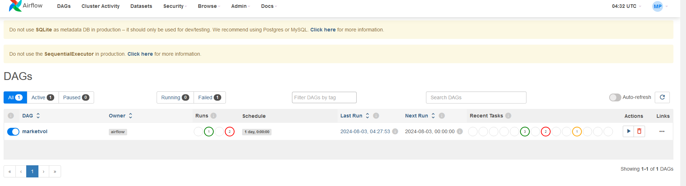

# Learning Objective
With this mini-project, we will utilize Apache Airflow to orchestrate  pipeline, exercise the
DAG creation, uses of various operators (BashOperator, PythonOperator, etc), setting up order
of operation of each task.

● Use Apache Airflow to orchestrate your pipeline
● Exercise DAG creation
● Use Various Airflow operators like BashOperator and PythonOperator
● Set up the order operation of each task
● Use Celery Executor to run your job

# Dag Generated

# Successfuly executed Dag

# output of excuted Dag

